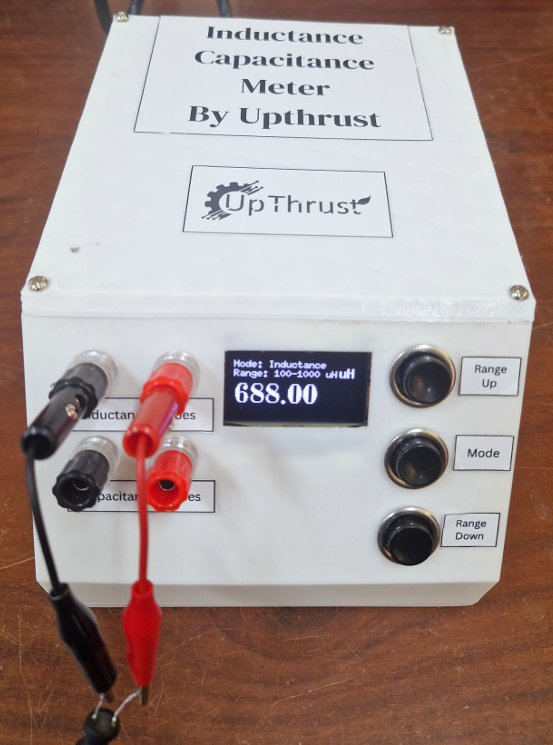
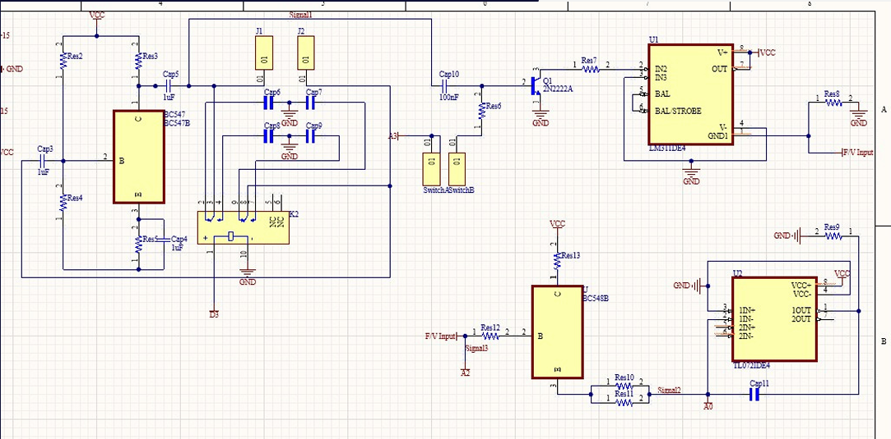
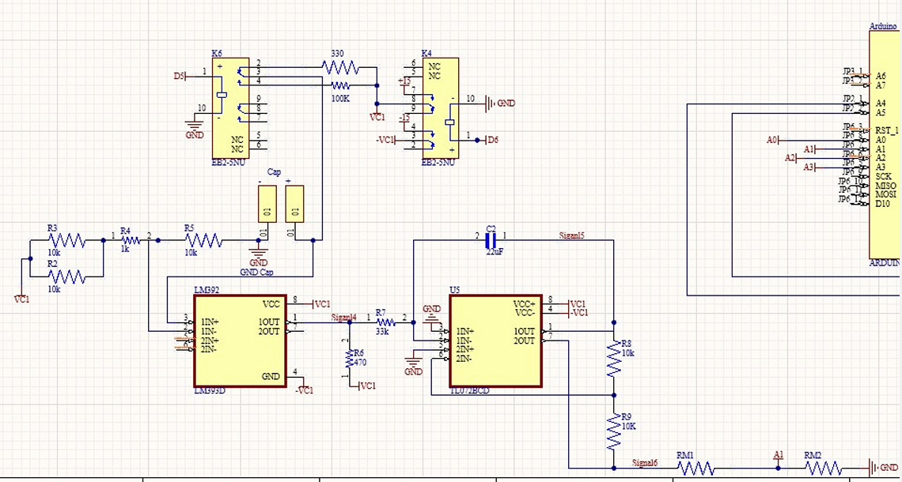
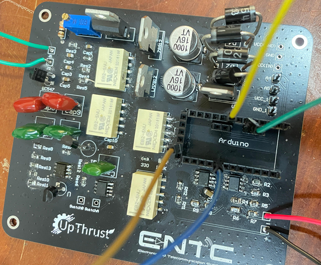

# Inductance Capacitance Meter

  

This project presents an Inductance-Capacitance (L-C) Meter designed and built as part of the Laboratory Practice and Projects module. This device is capable of measuring a wide range of inductance and capacitance values, making it an essential tool for electronics hobbyists and professionals.

## Table of Contents

- [Project Overview](#project-overview)
- [Features](#features)
- [How to Use](#how-to-use)
- [Hardware](#hardware)
  - [Components](#components)
  - [Circuit Design](#circuit-design)
  - [PCB Design](#pcb-design)
- [Software](#software)
- [Theory of Operation](#theory-of-operation)
  - [Inductance Measurement](#inductance-measurement)
  - [Capacitance Measurement](#capacitance-measurement)

## Project Overview

The Inductance Capacitance Meter is a project developed to provide a simple and accurate solution for measuring the inductance of inductors and the capacitance of capacitors. The device uses an Arduino Pro Mini to control the measurement process and a 1.54-inch OLED display to show the results. It features dedicated modes for both inductance and capacitance measurement with selectable ranges for improved accuracy.

## Features

-   **Dual Measurement Modes:** Measures both inductance and capacitance.
-   **Multiple Ranges:** Offers different measurement ranges for better precision.
-   **Clear Display:** A 1.54-inch 128x64 I2C OLED screen displays the mode, range, and measured value.
-   **User-Friendly Interface:** Operated by four buttons for power, mode selection, and range adjustment.
-   **Compact and Enclosed Design:** Housed in a custom-designed enclosure for protection and ease of use.

## How to Use

1.  **Power On:** Press the Power Button to turn on the device. A welcome screen will be displayed.
2.  **Mode Selection:** Use the "Mode" button to switch between Inductance and Capacitance measurement modes.
3.  **Range Selection:** Use the "Range Up" and "Range Down" buttons to select the appropriate measurement range for the component.
4.  **Component Insertion:** Connect the inductor or capacitor to the measuring probes.
5.  **Result Display:** The measured value will be shown on the OLED display.

## Hardware

### Components

-   **Microcontroller:** Arduino Pro Mini
-   **Display:** 1.54 inch 128x64 I2C OLED
-   **Operational Amplifier:** TL072 (for integrator)
-   **Comparator:** LM393 & LM311
-   **Transistor:** BC547B
-   Various resistors and capacitors for the measurement circuits.

### Circuit Design

The device comprises two main measurement circuits: one for inductance and one for capacitance.

**Inductance Measurement Circuit:**
This circuit is based on a Colpitts oscillator. The unknown inductor resonates with a known capacitor, and the resulting oscillation frequency is measured. This frequency is then converted to a voltage to calculate the inductance.

  

**Capacitance Measurement Circuit:**
This circuit works by charging the unknown capacitor and comparing its voltage to a reference. An integrator circuit is used to generate a ramp voltage, and by sampling this voltage at a specific time, the capacitance is determined.

  

### PCB Design

A custom PCB was designed to house all the components, ensuring a compact and reliable build.

  

## Software

The device is controlled by an Arduino sketch running on the Arduino Pro Mini. The software is responsible for:
-   Reading button inputs for mode and range selection.
-   Controlling the measurement circuits.
-   Calculating the inductance or capacitance based on the measured values.
-   Displaying the results on the OLED screen.
